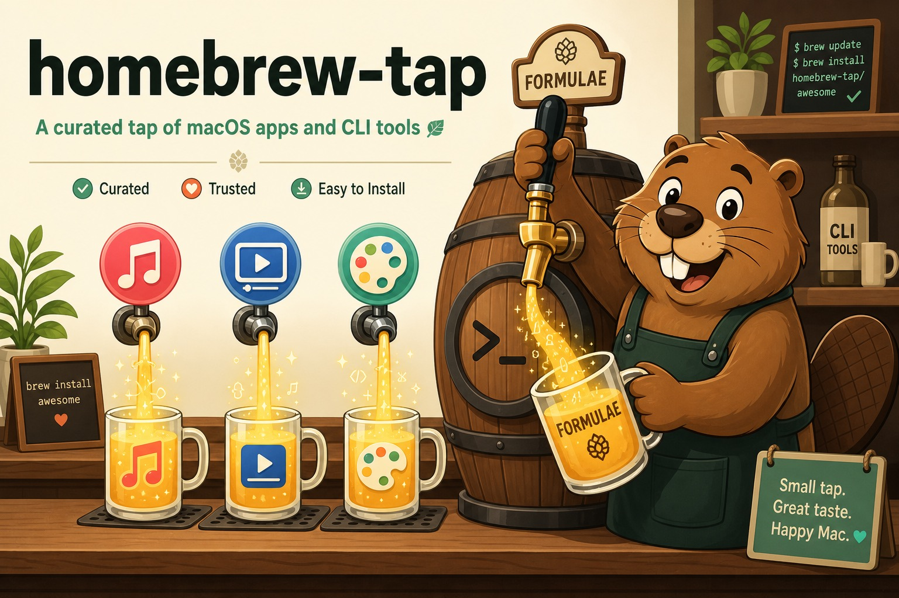

# homebrew-tap

    



## What's this?

A tap of Homebrew.
This tap includes my favorite apps but not in official taps or not major.

## How to tap

run command as below

```
brew tap generald/tap
```
